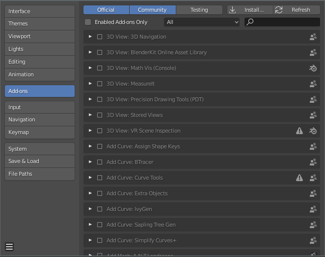
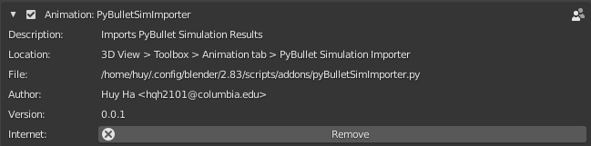
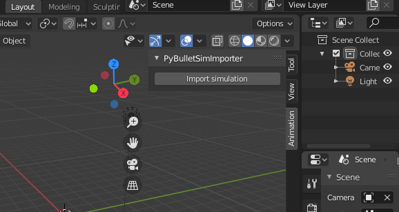
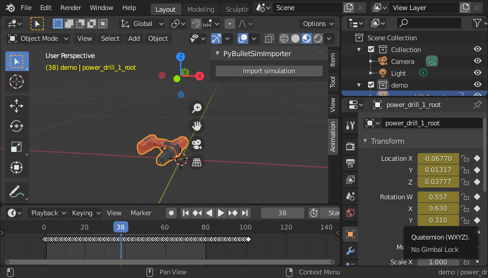

# Blender pyBullet Simulation Importer

This Blender plugin + python script allows you to easily import pyBullet simulations into Blender for visualizations.

Tested on `Ubuntu 18.04.5` with `Blender 2.83.3`.

## Setup

### Installing the Blender plugin

Make sure Blender is installed
```
sudo snap install blender --classic
```
Open up Blender, go to `Edit > Preferences > Add-ons` and click `[Install...]`.



Navigate to and import `pyBulletSimImporter.py`. Make sure the newly added `PyBulletSimImporter` add-on is enabled.



You should see an `Animation` tab to the right of the screen, where the UI for the importer is.



## Usage

### Recording a pyBullet Simulation

`PyBulletRecorder` track poses of individual links in pyBullet simulations along with their mesh path (taken from the URDF file), then save the animation out into a pickle file. `PyBulletSimImporter` consumes these pickle files, import the corresponding meshes, then animate those links with pose keyframes.

To record a pyBullet simulation, checkout `demo.py`
```py
from pyBulletSimRecorder import PyBulletRecorder
import pybullet as p
import pybullet_data

# Setup pyBullet
p.connect(p.GUI)
p.setAdditionalSearchPath(pybullet_data.getDataPath())
p.setRealTimeSimulation(0)
p.setGravity(0, 0, -9.81)
p.loadURDF('plane.urdf')

recorder = PyBulletRecorder()
urdf_path = 'assets/power_drill/power_drill.urdf'
body_id = p.loadURDF(
    fileName=urdf_path,
    basePosition=(0, 0, 0.4),
    baseOrientation=(0.4, 0.3, 0.2, 0.1))

# 1. Tell recorder to track a pybullet object
recorder.register_object(body_id, urdf_path)
for _ in range(500):
    p.stepSimulation()
    # 2. Take a snap shot of all registered link poses
    recorder.add_keyframe()
# 3. Dump simulation to a pickle file
recorder.save('demo.pkl')

```

### Importing a pyBullet Simulation to Blender

In the `PyBulletSimImporter` panel of the `Animation` tab in Blender, click on `[Import simulation]`. Navigate to and select the simulation pickle file you want to import.



Notes:
 - If the simulation is large (i.e: many registered pyBullet objects, many 1000s of time steps,...), it might take Blender a while to import. Blender will freeze while it's importing. This is normal.
 - You can import multiple pickle files at once into Blender, and they will each be organized under their own Blender collection.